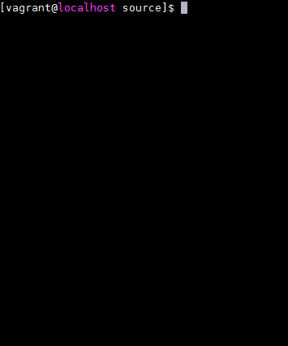

TETORICE
====

[](https://travis-ci.org/PruneMazui/tetorice)
[](https://coveralls.io/github/PruneMazui/tetorice?branch=master)

It is a game to erase the line.

## Demo



## Requirement

* PHP >= 5.6 or PHP >= 7.0
* POSIX

## Usage

```
wget https://github.com/PruneMazui/tetorice/archive/master.zip
unzip master.zip
cd tetorice-master

curl -sS https://getcomposer.org/installer | php
php composer.phar --no-dev
./bin/tetorice
```

## Licence

MIT
